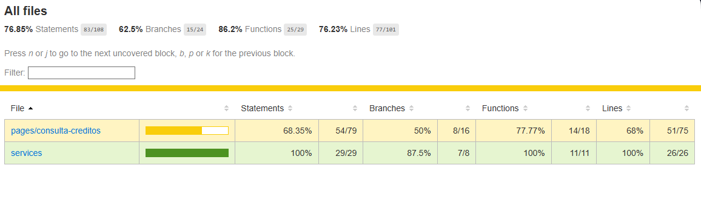

# GestionaApp

This project was generated using [Angular CLI](https://github.com/angular/angular-cli) version 19.2.15.

## Development server

To start a local development server, run:

```bash
ng serve --host 0.0.0.0 --port 4200
```

Once the server is running, open your browser and navigate to `http://localhost:4200/`. The application will automatically reload whenever you modify any of the source files.

## Code scaffolding

Angular CLI includes powerful code scaffolding tools. To generate a new component, run:

```bash
ng generate component component-name
```

For a complete list of available schematics (such as `components`, `directives`, or `pipes`), run:

```bash
ng generate --help
```

## Building

To build the project run:

```bash
ng build --configuration production
```

This will compile your project and store the build artifacts in the `dist/` directory. By default, the production build optimizes your application for performance and speed.

## Use essa url para acesso local:
```bash
http://localhost:4200/consulta-creditos/consulta-creditos
```


# Servir os arquivos estáticos localmente para testar
# Com http-server (instalar se não tiver)

```bash
npx http-server dist/ -p 8080
```
# Ou com serve
```bash
npx serve -s dist/ -l 8080
```

## Running end-to-end tests

For end-to-end (e2e) testing, run:

```bash
ng e2e
```


## Loading Docker Frontend container - Rebuild apenas o frontend:

Subindo o container com o cache limpo:
```bash
docker-compose build --no-cache frontend
```
ou 
```bash
docker-compose up -d frontend
```

## Rodando testes unitários

Para executar testes usando o [Karma](https://karma-runner.github.io),  use o comando a seguir:

No componente consulta-creditos:
```bash
ng test --watch=false --browsers=ChromeHeadless
```

Na service de creditos:
```bash
ng test --include="**/credito.service.spec.ts" --watch=false --browsers=ChromeHeadless
```

Resultado do teste:
